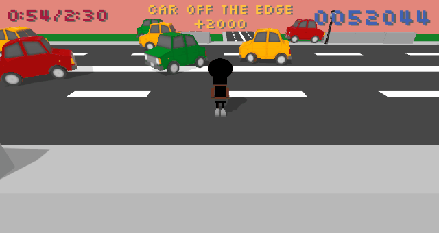
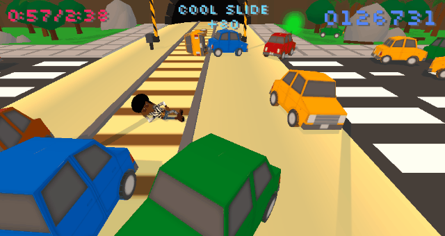

# Flashy Dansy
A minigame where you cause chaos dancing on a busy highway.

## About
Originally made for [#tagjam15](http://jams.gamejolt.io/tagjam15) gamejam (Oct 2014) in 3 days, later expanded with some new features and fixes.

Flashy Dansy was the winner of the gamejam and since then has over 18k downloads [on Gamejolt](http://gamejolt.com/games/platformer/flashy-dansy/35525/).

The project is now open source, mostly as a portfolio piece, but any contributions are welcome (see below).

## Gameplay Preview

## Usage

Made with Unity 2019.2. Upon cloning, you should be able to run immediately in Unity test mode, or build and run.

For mobile, the game should autodetect the platform and enable the mobile UI (virtual D-Pad). To manually enable it, enable `MobileGame` in Player component (or manually set `Player.onMobile` to true via script).

## Contributing

Any contributions are welcome and appreciated.
1. Fork the Project
2. Create your Feature Branch (`git checkout -b feature/AmazingFeature`)
3. Commit your Changes (`git commit -m 'Add some AmazingFeature'`)
4. Push to the Branch (`git push origin feature/AmazingFeature`)
5. Open a Pull Request

**NOTE:** the game originally uses two short clips of copyrighted music. In order to avoid copyright infringement, the clips have been replaced with clips from [Free Music Archive](https://freemusicarchive.org/).

## License

Distributed under the MIT License. See `LICENSE` for more information.

## Contact

Kostas Ventouras - [@kostasvs](https://github.com/kostasvs)

Project Link: [https://github.com/kostasvs/flashydansy](https://github.com/kostasvs/flashydansy)
